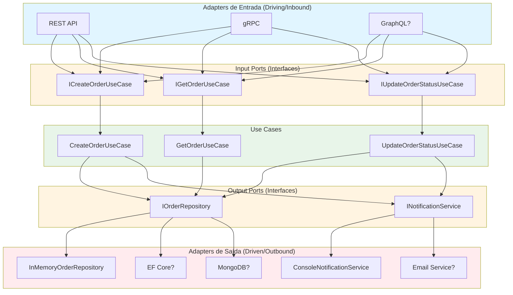
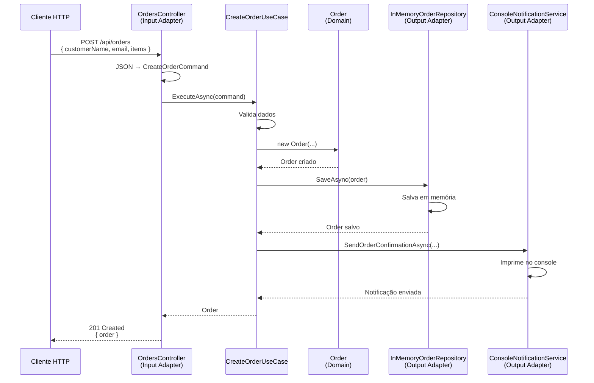
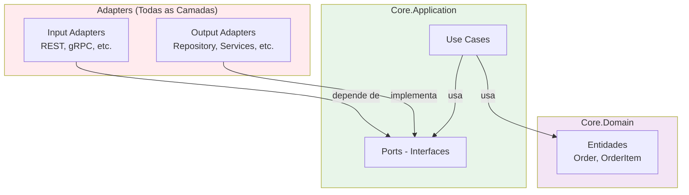

# Documentação da Arquitetura Hexagonal

## Visão Geral da Arquitetura

A Arquitetura Hexagonal separa a aplicação em três camadas principais:



## Conceitos Principais

### Core.Domain (Domínio)

**Responsabilidade**: Contém as entidades de negócio e regras de domínio puro.

**Características**:

- NÃO possui dependências de frameworks
- NÃO possui dependências de bibliotecas externas
- Contém apenas lógica de negócio
- É testável independentemente

**Exemplo**:

```csharp
public class Order
{
    public void Confirm()
    {
        if (Status != OrderStatus.Pending)
            throw new InvalidOperationException("Apenas pedidos pendentes podem ser confirmados");

        Status = OrderStatus.Confirmed;
    }
}
```

### Core.Application (Aplicação)

**Responsabilidade**: Orquestra o domínio e define os contratos (Ports).

**Ports de Entrada (Input Ports)**:

- Definem como o mundo exterior pode interagir com a aplicação
- São interfaces que os adapters de entrada implementam
- Exemplo: `ICreateOrderUseCase`

**Ports de Saída (Output Ports)**:

- Definem o que a aplicação precisa do mundo exterior
- São interfaces que os adapters de saída implementam
- Exemplo: `IOrderRepository`, `INotificationService`

**Use Cases**:

- Implementam a lógica de orquestração
- Utilizam os Ports de Saída, mas não conhecem suas implementações
- Exemplo: `CreateOrderUseCase`

### Adapters (Adaptadores)

#### Adapters de Entrada (Driving/Inbound)

Conectam o mundo exterior ao core da aplicação. Exemplos:

- **REST API**: Converte requisições HTTP/JSON em chamadas aos Use Cases
- **gRPC**: Converte requisições gRPC em chamadas aos Use Cases
- **GraphQL**: (pode ser adicionado) Converte queries GraphQL em chamadas aos Use Cases
- **CLI**: (pode ser adicionado) Converte comandos de linha em chamadas aos Use Cases

**Características**:

- Conhecem os Input Ports (interfaces dos Use Cases)
- NÃO conhecem os Output Ports (implementações)
- São facilmente substituíveis

#### Adapters de Saída (Driven/Outbound)

Implementam os contratos definidos pelos Output Ports. Exemplos:

- **InMemoryOrderRepository**: Implementa `IOrderRepository` usando memória
- **ConsoleNotificationService**: Implementa `INotificationService` usando console
- **EfCoreOrderRepository**: (pode ser adicionado) Implementa `IOrderRepository` usando Entity Framework
- **EmailNotificationService**: (pode ser adicionado) Implementa `INotificationService` usando SMTP

**Características**:

- Implementam Output Ports (interfaces)
- NÃO são conhecidos diretamente pelo Core
- São facilmente substituíveis via Dependency Injection

## Fluxo de Dados Completo

### Exemplo: Criar um Pedido via REST API



## Vantagens da Abordagem

### 1. Trocar Adapter de Entrada

**Cenário**: Você tem uma API REST e quer adicionar gRPC.

**Solução**: Crie `Adapters.Input.Grpc` que usa os mesmos Input Ports.

**Resultado**:

- Zero alteração no Core
- Zero alteração nos Use Cases
- Zero alteração nos Adapters de Saída

### 2. Trocar Adapter de Saída

**Cenário**: Você usa repositório In-Memory e quer mudar para Entity Framework.

**Solução**:

1. Crie `Adapters.Output.EfCore`
2. Implemente `IOrderRepository` usando EF Core
3. Altere apenas o registro no `DependencyInjection.cs`

**Resultado**:

- Zero alteração no Core
- Zero alteração nos Use Cases
- Zero alteração nos Adapters de Entrada

### 3. Testabilidade

**Cenário**: Testar um Use Case isoladamente.

**Solução**: Use mocks dos Output Ports.

```csharp
var mockRepository = new Mock<IOrderRepository>();
var mockNotification = new Mock<INotificationService>();
var useCase = new CreateOrderUseCase(mockRepository.Object, mockNotification.Object);

// Teste apenas a lógica de negócio
var result = await useCase.ExecuteAsync(command);
```

## Dependências

### Regra de Dependência



**Regra:** `Adapters → Core.Application → Core.Domain`

- **Adapters dependem de Core.Application**
- **Core.Application NUNCA depende de Adapters**
- **Core.Domain não depende de NADA**

## Como Adicionar um Novo Adapter

### Adicionar Adapter de Entrada (ex: GraphQL)

1. Crie o projeto:

```bash
dotnet new classlib -n Adapters.Input.GraphQL
```

2. Adicione referência:

```xml
<ProjectReference Include="..\Core.Application\Core.Application.csproj" />
```

3. Implemente resolvers que usam os Input Ports:

```csharp
public class OrderQuery
{
    public async Task<Order> CreateOrder(CreateOrderInput input, [Service] ICreateOrderUseCase useCase)
    {
        var command = new CreateOrderCommand(...);
        return await useCase.ExecuteAsync(command);
    }
}
```

4. Registre no Host

Sem alterar nada no Core.

### Adicionar Adapter de Saída (ex: Email)

1. Crie o projeto:

```bash
dotnet new classlib -n Adapters.Output.Email
```

2. Adicione referência:

```xml
<ProjectReference Include="..\Core.Application\Core.Application.csproj" />
```

3. Implemente o Output Port:

```csharp
public class EmailNotificationService : INotificationService
{
    public async Task SendOrderConfirmationAsync(string email, Guid orderId, decimal totalAmount)
    {
        // Enviar email usando SMTP
    }
}
```

4. Registre no `DependencyInjection.cs`:

```csharp
services.AddScoped<INotificationService, EmailNotificationService>();
```

Sem alterar nada no Core ou nos Adapters de Entrada.

## Referências e Leitura Adicional

- [Hexagonal Architecture - Alistair Cockburn](https://alistair.cockburn.us/hexagonal-architecture/)
- [Ports and Adapters Pattern](https://www.hexagonalarchitecture.net/)
- Artigo mencionado: [Hexagonal Architecture Demystified](https://medium.com/beyond-the-brackets/hexagonal-architecture-demystified-94fd4f9c49ce)
