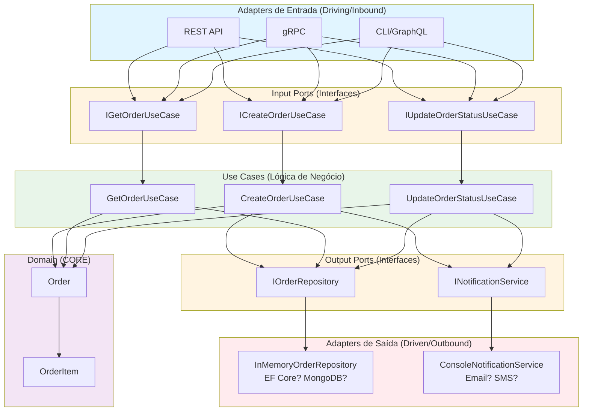
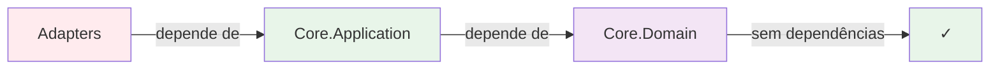

# Conceitos da Arquitetura Hexagonal

## O que é Arquitetura Hexagonal?

A **Arquitetura Hexagonal** (também conhecida como **Ports and Adapters**) foi criada por **Alistair Cockburn** com o objetivo de isolar a **lógica de negócio** dos **detalhes técnicos** da aplicação.

### Objetivo Principal

> **"Permitir que uma aplicação seja igualmente dirigida por usuários, programas, testes automatizados ou scripts em lote, e desenvolvida e testada isoladamente de seus dispositivos de execução."** - Alistair Cockburn

## Estrutura Visual



## Conceitos Fundamentais

### 1. CORE (Núcleo da Aplicação)

O **Core** é o coração da aplicação e contém:

#### **Domain (Domínio)**

- **Entidades de negócio** (Order, OrderItem)
- **Regras de domínio** (validações de negócio)
- **Value Objects** (quando aplicável)
- **SEM dependências externas**
- **SEM frameworks**
- **SEM bibliotecas** (exceto .NET básico)

**Exemplo:**

```csharp
// Core.Domain
public class Order
{
    public void Confirm()
    {
        if (Status != OrderStatus.Pending)
            throw new InvalidOperationException("Apenas pedidos pendentes podem ser confirmados");

        Status = OrderStatus.Confirmed;
    }
}
```

#### **Application (Aplicação)**

- **Ports (Interfaces)**
  - **Input Ports**: Interfaces que definem como o mundo exterior pode usar a aplicação
  - **Output Ports**: Interfaces que definem o que a aplicação precisa do mundo exterior
- **Use Cases (Casos de Uso)**: Orquestram o domínio e implementam a lógica de aplicação
- Depende apenas do **Domain**
- **NÃO conhece** como os Ports são implementados

**Exemplo:**

```csharp
// Core.Application (Use Case)
public class CreateOrderUseCase : ICreateOrderUseCase
{
    private readonly IOrderRepository _orderRepository;

    public async Task<Order> ExecuteAsync(CreateOrderCommand command)
    {
        var order = new Order(...);
        return await _orderRepository.SaveAsync(order);
    }
}
```

### 2. PORTS (Portas)

Os **Ports** são **interfaces** que definem os **contratos** entre o Core e o mundo exterior.

#### **Input Ports (Portas de Entrada)**

- Definem **COMO** o mundo exterior pode interagir com a aplicação
- São **interfaces** que os Use Cases implementam
- Exemplo: `ICreateOrderUseCase`, `IGetOrderUseCase`

```csharp
// Input Port
public interface ICreateOrderUseCase
{
    Task<Order> ExecuteAsync(CreateOrderCommand command);
}
```

#### **Output Ports (Portas de Saída)**

- Definem **O QUE** a aplicação precisa do mundo exterior
- São **interfaces** que os Adapters de Saída implementam
- Exemplo: `IOrderRepository`, `INotificationService`

```csharp
// Output Port
public interface IOrderRepository
{
    Task<Order> SaveAsync(Order order);
    Task<Order?> GetByIdAsync(Guid id);
}
```

### 3. ADAPTERS (Adaptadores)

Os **Adapters** são implementações concretas que conectam o Core ao mundo exterior.

#### **Input Adapters (Adaptadores de Entrada / Driving)**

- Conectam **entrada externa** → **Input Ports**
- Convertem requisições externas (HTTP, gRPC, CLI) em chamadas aos Use Cases
- Exemplo: REST Controller, gRPC Service

```csharp
// Input Adapter (REST)
public class OrdersController : ControllerBase
{
    private readonly ICreateOrderUseCase _createOrderUseCase;

    [HttpPost]
    public async Task<ActionResult> CreateOrder([FromBody] CreateOrderRequest request)
    {
        var command = new CreateOrderCommand(...);
        var order = await _createOrderUseCase.ExecuteAsync(command);
        return Ok(order);
    }
}
```

#### **Output Adapters (Adaptadores de Saída / Driven)**

- Conectam **Output Ports** → **infraestrutura externa**
- Implementam as interfaces definidas pelos Output Ports
- Exemplo: Repository (In-Memory, EF Core, MongoDB), NotificationService (Email, SMS)

```csharp
// Output Adapter
public class InMemoryOrderRepository : IOrderRepository
{
    public async Task<Order> SaveAsync(Order order)
    {
        _orders[order.Id] = order;
        return order;
    }
}
```

## Regras de Dependência

### Regra Fundamental: Direção das Dependências



**Regra:** `Adapters → Core.Application → Core.Domain`

**O Core NUNCA depende de Adapters!**

### Dependências Corretas

1. **Core.Domain**:

   - **NENHUMA dependência externa**
   - Apenas tipos .NET básicos

2. **Core.Application**:

   - Depende de `Core.Domain`
   - Define interfaces (Ports)
   - **NÃO depende** de Adapters

3. **Adapters.Input**:

   - Dependem de `Core.Application` (Input Ports)
   - Implementam conversão de protocolo → Use Cases

4. **Adapters.Output**:
   - Dependem de `Core.Application` (Output Ports)
   - Implementam interfaces dos Output Ports

### Dependências Incorretas

1. **Core.Domain** dependendo de frameworks:

```csharp
// ERRADO
using Microsoft.EntityFrameworkCore;

public class Order
{
    // ...
}
```

2. **Core.Application** conhecendo implementações:

```csharp
// ERRADO
using Adapters.Output.Persistence;

public class CreateOrderUseCase
{
    private readonly InMemoryOrderRepository _repository;
}
```

3. **Use Cases** conhecendo detalhes técnicos:

```csharp
// ERRADO
public class CreateOrderUseCase
{
    public async Task<Order> ExecuteAsync(HttpRequest request)
    {
        // ...
    }
}
```

## Princípios da Arquitetura Hexagonal

### 1. Isolamento do Domínio

O domínio é **independente** de qualquer tecnologia ou framework.

### 2. Inversão de Dependência

O Core **define interfaces** (Ports), os Adapters **implementam** essas interfaces.

### 3. Testabilidade

O Core pode ser testado **sem** depender de infraestrutura externa (usando mocks).

### 4. Flexibilidade

Adapters podem ser **trocados** sem alterar o Core.

### 5. Clareza

Responsabilidades são **claramente separadas**.

## Conceitos Avançados

### Dependency Injection (DI)

A DI é usada para "inverter" as dependências:

- Use Cases recebem **interfaces** via construtor
- Em tempo de execução, o **container de DI** injeta as **implementações**

```csharp
// Infrastructure/DependencyInjection.cs
services.AddScoped<ICreateOrderUseCase, CreateOrderUseCase>();
services.AddSingleton<IOrderRepository, InMemoryOrderRepository>();
```

### Clean Architecture vs Hexagonal

- **Arquitetura Hexagonal**: Foca em Ports e Adapters
- **Clean Architecture**: Estruturada em camadas (Domain, Application, Infrastructure)
- Ambas buscam **isolar o domínio**, mas com organizações diferentes

## Recursos para Aprofundar

1. [Hexagonal Architecture - Alistair Cockburn](https://alistair.cockburn.us/hexagonal-architecture/)
2. [Ports and Adapters Pattern](https://www.hexagonalarchitecture.net/)
3. Artigo mencionado: [Hexagonal Architecture Demystified](https://medium.com/beyond-the-brackets/hexagonal-architecture-demystified-94fd4f9c49ce)

---

Para análise específica da implementação deste projeto, consulte `ANALISE_IMPLEMENTACAO.md`.
