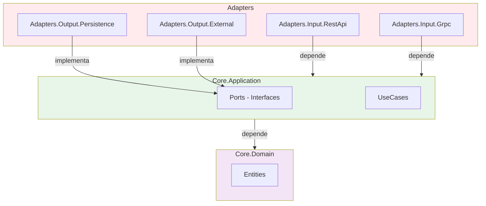

# Arquitetura Hexagonal em .NET

## Sobre o Projeto

Este projeto demonstra a implementação da **Arquitetura Hexagonal** (também conhecida como **Ports and Adapters**) em .NET 8.0. O objetivo é mostrar como criar uma aplicação flexível onde o núcleo da aplicação (domínio e lógica de negócio) é independente dos detalhes técnicos, permitindo trocar facilmente os adapters de entrada (REST, gRPC, GraphQL, etc.) e saída (repositórios, serviços externos).

### Objetivos

- Demonstrar o isolamento do domínio e lógica de negócio
- Mostrar como plugar diferentes adapters de entrada (REST JSON e gRPC)
- Facilitar a troca de adapters de saída (repositório, serviços externos)
- Servir como referência para projetos reais

## Estrutura do Projeto

```
Hexagonal-Project/
├── src/
│   ├── Core.Domain/              # Camada de Domínio (sem dependências externas)
│   │   └── Entities/             # Entidades de negócio (Order, OrderItem)
│   │
│   ├── Core.Application/         # Camada de Aplicação (Ports e Use Cases)
│   │   ├── Ports/
│   │   │   ├── Input/           # Ports de Entrada (interfaces para casos de uso)
│   │   │   └── Output/          # Ports de Saída (interfaces para repositórios, serviços)
│   │   └── UseCases/            # Implementação dos casos de uso
│   │
│   ├── Adapters.Input.RestApi/   # Adapter de Entrada - REST API (JSON)
│   │   └── Controllers/         # Controllers que convertem HTTP/JSON em Use Cases
│   │
│   ├── Adapters.Input.Grpc/      # Adapter de Entrada - gRPC
│   │   ├── Protos/              # Definições gRPC (.proto)
│   │   └── Services/            # Serviços gRPC que convertem em Use Cases
│   │
│   ├── Adapters.Output.Persistence/  # Adapter de Saída - Repositório
│   │   └── InMemoryOrderRepository   # Implementação em memória (pode ser EF Core, MongoDB, etc.)
│   │
│   ├── Adapters.Output.External/     # Adapter de Saída - Serviços Externos
│   │   └── ConsoleNotificationService # Implementação de notificações (pode ser Email, SMS, etc.)
│   │
│   ├── Infrastructure/           # Configuração e DI
│   │   └── DependencyInjection.cs
│   │
│   └── Host/                     # Aplicação Host (conecta tudo)
│       └── Program.cs
│
└── Hexagonal-Project.sln
```

### Diagrama de Dependências



## Conceitos Principais

A Arquitetura Hexagonal (também conhecida como Ports and Adapters) isola a lógica de negócio dos detalhes técnicos. O projeto está organizado em:

- **Core.Domain**: Entidades de negócio e regras de domínio (sem dependências externas)
- **Core.Application**: Casos de uso e interfaces (Ports) que definem contratos
- **Adapters**: Implementações que conectam o Core ao mundo exterior (REST, gRPC, Repositórios, Serviços)

Para entender melhor os conceitos, consulte `CONCEITOS_HEXAGONAL.md`.

## Como Executar

### Pré-requisitos

- .NET 8.0 SDK ou superior
- Visual Studio 2022, VS Code ou Rider

### Executando o Projeto

1. Clone o repositório:

```bash
git clone <seu-repositorio>
cd Hexagonal-Project
```

2. Restaure as dependências:

```bash
dotnet restore
```

3. Execute o projeto Host:

```bash
dotnet run --project src/Host/Host.csproj
```

4. Acesse:
   - **Swagger UI**: https://localhost:5001/swagger (ou http://localhost:5000/swagger)
   - **gRPC**: Disponível na porta configurada (5001 por padrão)

## Exemplos de Uso

O projeto oferece:

- **REST API**: Endpoints HTTP/JSON para gerenciar pedidos (`/api/orders`)
- **gRPC**: Serviços gRPC com os mesmos recursos, usando protocolo diferente

Para exemplos detalhados de requisições e respostas, consulte `EXEMPLOS.md`.

## Benefícios da Arquitetura Hexagonal

1. **Independência**: O domínio não depende de frameworks ou bibliotecas externas
2. **Testabilidade**: Fácil criar mocks dos ports para testes unitários
3. **Flexibilidade**: Trocar adapters sem alterar o código do domínio
4. **Manutenibilidade**: Código organizado e responsabilidades bem definidas
5. **Evolução**: Adicionar novos adapters (GraphQL, Kafka, etc.) sem impactar o core

## Documentação Adicional

Para mais informações, consulte:

- `ARQUITETURA.md` - Documentação detalhada da arquitetura
- `CONCEITOS_HEXAGONAL.md` - Conceitos fundamentais da Arquitetura Hexagonal
- `EXEMPLOS.md` - Exemplos práticos de uso

## Licença

Este projeto é um exemplo educacional e está disponível para uso livre.

## Referências

- [Hexagonal Architecture Demystified](https://medium.com/beyond-the-brackets/hexagonal-architecture-demystified-94fd4f9c49ce)
- [Alistair Cockburn - Hexagonal Architecture](https://alistair.cockburn.us/hexagonal-architecture/)
- [Microsoft - Clean Architecture](https://learn.microsoft.com/en-us/dotnet/architecture/modern-web-apps-azure/common-web-application-architectures)

## Contribuindo

Contribuições são bem-vindas! Sinta-se à vontade para abrir issues ou pull requests.
